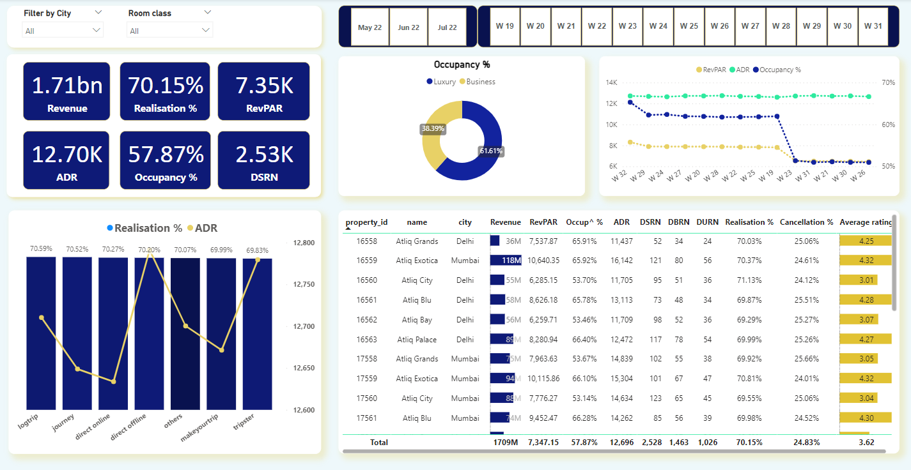
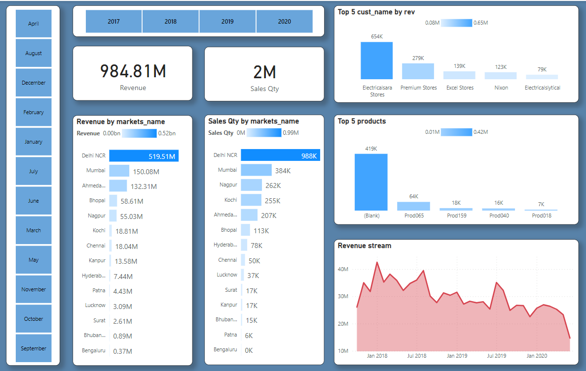

# Shreyash's Portfolio

## Project-1 : Revenue Insight in Hospitality Domain

✦ Data was taken from a github repository(dataset of demo company).

✦ The techstack involves in the project are Power BI and Excel.

✦ The project involves data cleaning, data visualization and statistical analysis.

✦ Created a dashboard in Power BI using three months of data.

✦ With the created dashboard, Revenue team of Atliq Grands were able to gain insights about their revenue trend.

#Atliq Grand Analysis  

## Project-2 : Sales Insight of AtliQ Hardware

✦ Data was provided by Codebasic(youtube) - a demo dataset of company named AtliQ Hardware.

✦ The techstack involves in the project are Power BI and SQL.

✦ The project involves data cleaning,data modelling, data visualization and statistical analysis.

✦ Designed a Power BI dashboard to understand AtliQ hardware goods sales trend.

✦ The final dashboard was effective at displaying the sales allowing users to understand the data and make informed decisions.

#Atliq Hardware Analysis  

## Project-3 : Sales Insights of Supermarket

✦ Data was taken from kaggle.

✦ The project was based on Python- libraries used are Numpy, Pandas, Seaborn and Matplotlib.

✦ This project involves data collection, data modelling , data visualization, and statistical analysis.

✦ At the end the conclusion found in this project help the store to increase its revenue by targeting a segment of customer.

#Supermarket Sales Analysis  .png) .png)
 
